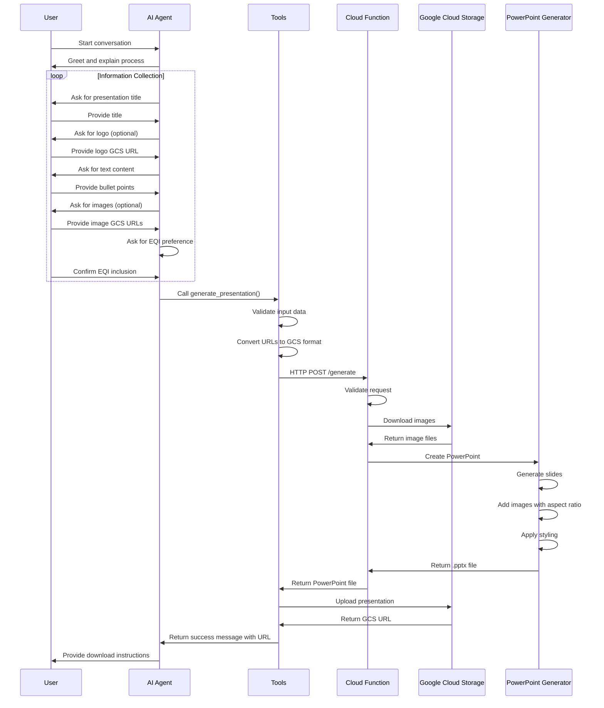
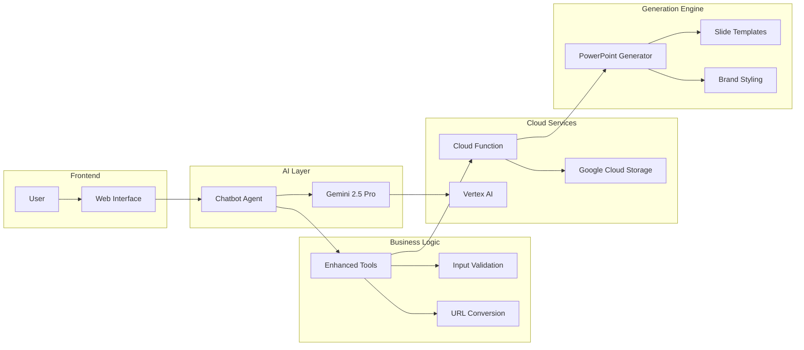
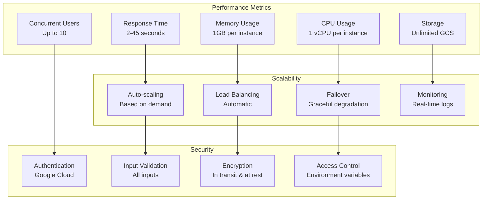
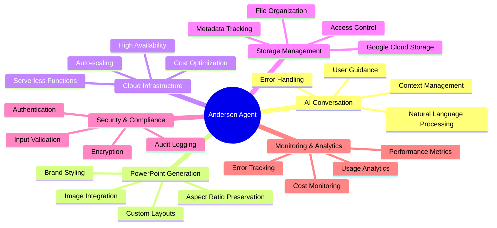

# Anderson Agent - System Architecture Diagram

## 🏗️ Complete System Architecture

```mermaid
graph TB
    %% User Interface Layer
    subgraph "User Interface Layer"
        UI[User Interface]
        WEB[Web Interface<br/>Optional]
        DEMO[Local Demo<br/>demo.py]
        ADK[ADK Web Interface<br/>adk web]
    end

    %% AI Agent Layer
    subgraph "AI Agent Layer"
        AGENT[Presentation Chatbot Agent<br/>agent.py]
        CONFIG[Configuration<br/>config.py]
        PROMPTS[Prompts & Instructions<br/>prompts.py]
        
        subgraph "Agent Components"
            GEMINI[Gemini 2.5 Pro<br/>AI Model]
            CONV[Conversation<br/>Management]
            TOOLS[Tool Routing<br/>& Orchestration]
        end
    end

    %% Tool Layer
    subgraph "Tool Layer"
        TOOLS_ENHANCED[Enhanced Tools<br/>tools_enhanced.py]
        
        subgraph "Available Tools"
            GEN_PRES[generate_presentation()]
            GET_TEMPLATES[get_presentation_templates()]
            LIST_PRES[list_presentations()]
        end
    end

    %% Cloud Function Layer
    subgraph "Cloud Function Layer"
        CF[PowerPoint Generator<br/>main.py]
        
        subgraph "Function Components"
            HTTP[HTTP Handler<br/>ppt_generator]
            IMG_PROC[Image Processor<br/>download_from_gcs]
            PRES_GEN[Presentation Generator<br/>generate_presentation]
        end
        
        subgraph "Endpoints"
            HEALTH[GET /health]
            TEMPLATES[GET /templates]
            GENERATE[POST /generate]
        end
    end

    %% PowerPoint Generator
    subgraph "PowerPoint Generator"
        PPT[simple_presentation.py]
        
        subgraph "PPT Components"
            SLIDE[Slide Creation]
            IMG_HANDLE[Image Handling<br/>Aspect Ratio]
            STYLING[Styling & Branding]
            LAYOUT[Layout Management]
        end
    end

    %% Storage Layer
    subgraph "Storage Layer"
        GCS_IMAGES[Google Cloud Storage<br/>Images & Logos]
        GCS_PRES[Google Cloud Storage<br/>Presentations]
        LOCAL_RES[Local Resources<br/>slides_stateful_resources]
    end

    %% Deployment
    subgraph "Deployment"
        DEPLOY[deploy.py]
        GCLOUD[Google Cloud Functions]
    end

    %% Connections
    UI --> AGENT
    WEB --> AGENT
    DEMO --> AGENT
    ADK --> AGENT
    
    AGENT --> CONFIG
    AGENT --> PROMPTS
    AGENT --> GEMINI
    AGENT --> CONV
    AGENT --> TOOLS
    
    AGENT --> TOOLS_ENHANCED
    TOOLS_ENHANCED --> GEN_PRES
    TOOLS_ENHANCED --> GET_TEMPLATES
    TOOLS_ENHANCED --> LIST_PRES
    
    GEN_PRES --> CF
    GET_TEMPLATES --> CF
    LIST_PRES --> GCS_PRES
    
    CF --> HTTP
    HTTP --> HEALTH
    HTTP --> TEMPLATES
    HTTP --> GENERATE
    
    GENERATE --> IMG_PROC
    GENERATE --> PRES_GEN
    
    IMG_PROC --> GCS_IMAGES
    PRES_GEN --> PPT
    
    PPT --> SLIDE
    PPT --> IMG_HANDLE
    PPT --> STYLING
    PPT --> LAYOUT
    
    IMG_HANDLE --> LOCAL_RES
    STYLING --> LOCAL_RES
    
    DEPLOY --> GCLOUD
    GCLOUD --> CF

    %% Styling
    classDef userLayer fill:#e1f5fe,stroke:#01579b,stroke-width:2px
    classDef agentLayer fill:#f3e5f5,stroke:#4a148c,stroke-width:2px
    classDef toolLayer fill:#e8f5e8,stroke:#1b5e20,stroke-width:2px
    classDef cloudLayer fill:#fff3e0,stroke:#e65100,stroke-width:2px
    classDef storageLayer fill:#fce4ec,stroke:#880e4f,stroke-width:2px
    classDef deployLayer fill:#f1f8e9,stroke:#33691e,stroke-width:2px

    class UI,WEB,DEMO,ADK userLayer
    class AGENT,CONFIG,PROMPTS,GEMINI,CONV,TOOLS agentLayer
    class TOOLS_ENHANCED,GEN_PRES,GET_TEMPLATES,LIST_PRES toolLayer
    class CF,HTTP,IMG_PROC,PRES_GEN,HEALTH,TEMPLATES,GENERATE cloudLayer
    class GCS_IMAGES,GCS_PRES,LOCAL_RES storageLayer
    class DEPLOY,GCLOUD deployLayer
```

## 🔄 Data Flow Architecture



## 🏢 Component Interaction Diagram



## 📊 System Metrics and Performance



## 🔧 Technical Stack



```mermaid
graph TB
    subgraph "Programming Languages"
        PYTHON[Python 3.11]
        MARKDOWN[Markdown]
        YAML[YAML Configuration]
    end
    
    subgraph "AI & ML"
        GEMINI[Google Gemini 2.5 Pro]
        ADK[Google ADK]
        VERTEX[Vertex AI]
    end
    
    subgraph "Cloud Services"
        GCP[Google Cloud Platform]
        CLOUD_FUNCTIONS[Cloud Functions]
        CLOUD_STORAGE[Cloud Storage]
        CLOUD_BUILD[Cloud Build]
    end
    
    subgraph "Libraries & Frameworks"
        PPTX[python-pptx]
        PIL[Pillow]
        REQUESTS[Requests]
        PYDANTIC[Pydantic]
        FLASK[Flask]
    end
    
    subgraph "Development Tools"
        POETRY[Poetry]
        PIP[Pip]
        GCLOUD[gcloud CLI]
        DOCKER[Docker]
    end
    
    PYTHON --> GEMINI
    PYTHON --> ADK
    PYTHON --> VERTEX
    PYTHON --> CLOUD_FUNCTIONS
    PYTHON --> CLOUD_STORAGE
    PYTHON --> PPTX
    PYTHON --> PIL
    PYTHON --> REQUESTS
    PYTHON --> PYDANTIC
    PYTHON --> FLASK
    PYTHON --> POETRY
    PYTHON --> PIP
    PYTHON --> GCLOUD
    PYTHON --> DOCKER
```

## 🎯 Key Features Architecture



This architecture diagram provides a comprehensive view of how the Anderson Agent system works, showing the relationships between all components, data flow, and technical implementation details.
